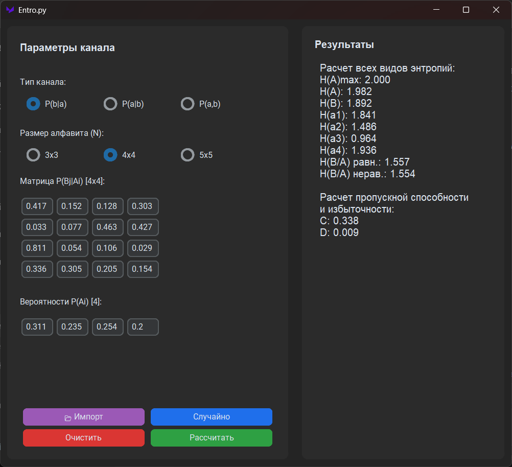

# 📐 Калькулятор энтропии и пропускной способности канала (Entropy Calculator)

Учебное приложение для автоматизации сложных математических расчетов по дисциплине "Теория информации". Программа вычисляет различные виды энтропии, пропускную способность канала связи и избыточность, поддерживая три типа представления вероятностей.

## 🛠 Стек технологий
- **Язык:** Python 3.13
- **GUI:** CustomTkinter (динамическая генерация интерфейса)
- **Математика:** Встроенный модуль `math`
- **Работа с данными:** `openpyxl` (импорт матриц из Excel)
- **Сборка:** PyInstaller

## ✨ Ключевой функционал
- **Комплексные расчеты:** Вычисление маргинальных, совместных, частных и средних условных энтропий (Шеннона), а также пропускной способности канала.
- **Гибкий ввод данных:** Поддержка матриц $P(B|A)$, $P(A|B)$ и совместных вероятностей $P(A,B)$ с размерностью 3x3, 4x4, 5x5.
- **Автоматическая нормализация:** Алгоритм автоматически корректирует введенные пользователем данные, чтобы сумма вероятностей в строках/столбцах строго равнялась 1.0 (с учетом погрешностей округления float).
- **Генерация и импорт:** Возможность мгновенно заполнить форму валидными случайными данными или загрузить готовую матрицу из Excel-файла.

## 🚀 Как запустить проект

1. Клонируйте репозиторий:
   ```bash
   git clone https://github.com/acidkil1/entro.py.git
   cd entro.py
   ```
2. Создайте и активируйте виртуальное окружение:
   ```bash
   python -m venv venv
   source venv/bin/activate  # Для Windows: venv\Scripts\activate
   ```
3. Установите зависимости:
   ```bash
   pip install -r requirements.txt
   ```
4. Запустите приложение:
   ```bash
   python main.py
   ```

## 🧠 Чему я научился и какие навыки развил (Key Takeaways)
Работа над математическим ПО потребовала особого внимания к деталям и граничным условиям (edge cases).
- **Работа с граничными условиями (Edge Cases):** Я реализовал алгоритм нормализации, который не просто делит числа, но и корректирует последний элемент вектора/строки, чтобы компенсировать погрешности округления floating-point чисел и гарантировать, что сумма вероятностей всегда равна ровно `1.0`. Также добавлена защита от деления на ноль при расчете условных вероятностей.
- **Алгоритмическое мышление:** Перевод абстрактных математических формул (энтропия Шеннона, формулы полной вероятности) в эффективный и читаемый код на Python. Использование списковых включений (list comprehensions) для чистоты кода.
- **Динамический UI:** Научился программно генерировать и перестраивать элементы графического интерфейса (сетки полей ввода) "на лету" в зависимости от выбора пользователя (размер матрицы и тип канала), не перезагружая приложение.

## 📸 Скриншоты

